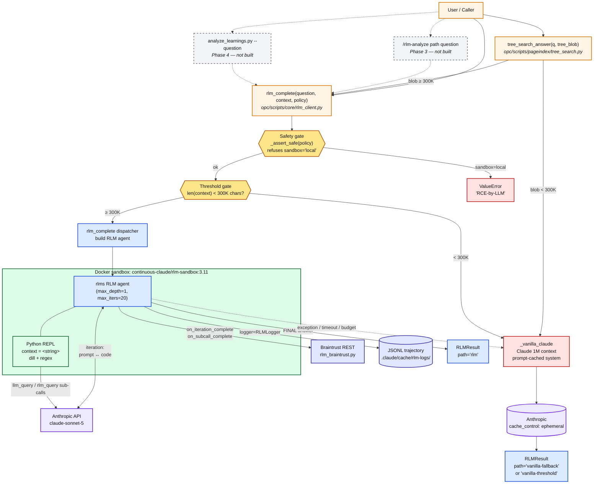
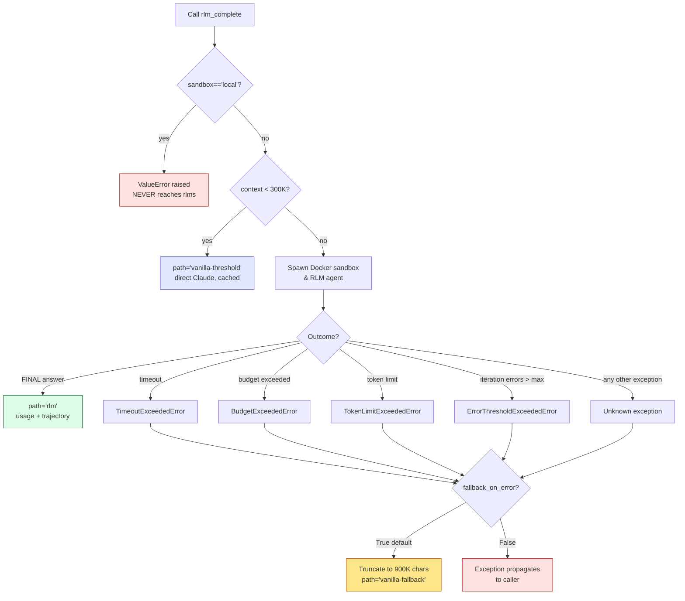
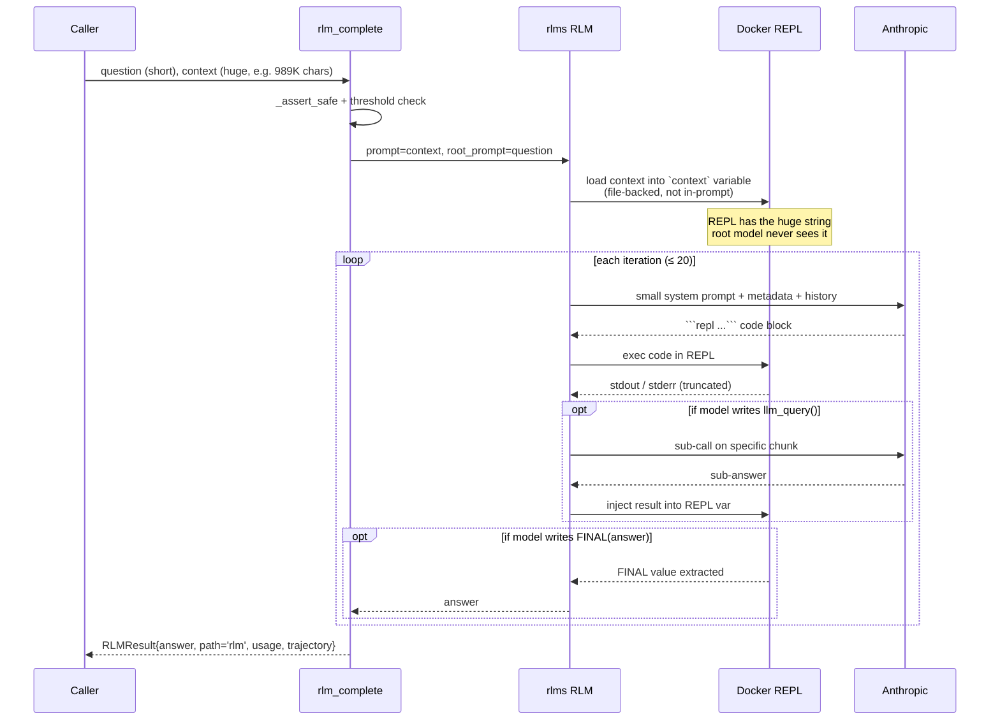

# RLM (Recursive Language Models) — Architecture

**Role:** The explicit escape hatch for analyzing inputs that overflow the normal context window — whole-repo sweeps, very large documents, multi-file corpora. Currently **dormant**: the engine is wired (Phases 0–2) but no active flow invokes it automatically; reach for it deliberately via the `rlm-analyze` skill / `/rlm-analyze path "question"`. Requires Docker + `ANTHROPIC_API_KEY`.

Status: **MVP in place** (Phase 0 + Phase 1 + Phase 2 shipped 2026-04-23). Docker sandbox required. `max_depth=1` locked.
Reference: paper [arXiv:2512.24601](https://arxiv.org/abs/2512.24601), library [alexzhang13/rlm](https://github.com/alexzhang13/rlm), adoption plan `~/.claude/plans/i-have-a-new-abstract-quail.md`.

**Interactive diagram:** https://excalidraw.com/#json=H5mTGt2vW4v9tcU0rt_Em,68fP_0OLmliMRLcrSm5hxQ
**Local file:** [`rlm-architecture.excalidraw`](./rlm-architecture.excalidraw) (open in excalidraw.com or the VS Code Excalidraw plugin)

---

## 1. High-level flow

---

## 2. Safety layer stack

```mermaid
flowchart LR
    classDef c fill:#fee2e2,stroke:#b91c1c,color:#111
    classDef h fill:#fde68a,stroke:#b45309,color:#111
    classDef m fill:#dcfce7,stroke:#166534,color:#111

    IN[[Caller intent]]:::m
    --> L1["Layer 1 — Static policy<br/>RLMPolicy frozen dataclass<br/>defaults immutable at call site"]:::m
    --> L2["Layer 2 — _assert_safe<br/>refuses sandbox='local'<br/>raises ValueError"]:::c
    --> L3["Layer 3 — Threshold gate<br/>below 300K chars → vanilla<br/>avoids pointless RLM overhead"]:::h
    --> L4["Layer 4 — rlms caps<br/>max_depth=1 (Wang repro)<br/>max_iterations=20<br/>max_timeout=480s<br/>max_budget=$2.00<br/>max_tokens=500K"]:::c
    --> L5["Layer 5 — Docker sandbox<br/>non-root user<br/>no host mount<br/>ephemeral container"]:::c
    --> L6["Layer 6 — Fallback<br/>any RLM exception → vanilla Claude<br/>prompt-cached context<br/>deterministic"]:::h
    --> OUT[[Answer]]:::m
```

---

## 3. Failure mode decision tree

---

## 4. Data flow — where the long context actually lives

Key insight: **the root model never sees the full 989K chars.** It sees a short metadata block (`"Your context is a str with 989,347 total characters..."`) and writes code to slice/search it. The REPL does the heavy lifting deterministically.

---

## 5. File map — what lives where today

| Layer | File | Role |
|---|---|---|
| Entry | `opc/scripts/core/rlm_client.py` | `rlm_complete`, `RLMPolicy`, `RLMResult`, `_assert_safe`, `_vanilla_claude` |
| Entry | `opc/scripts/pageindex/tree_search.py` | `tree_search_answer` — escalates to RLM when tree_blob ≥ 300K |
| Observability | `opc/scripts/core/rlm_braintrust.py` | `emit_rlm_trajectory` — REST to Braintrust |
| Tests | `opc/tests/test_rlm_client.py` | 4 tests: sandbox refusal, threshold, fallback, fail-hard |
| Sandbox | `.claude/docker/rlm-sandbox/Dockerfile` | `python:3.11-slim` + dill + regex, non-root user |
| Dep | `opc/pyproject.toml` | `rlms>=0.1.1` in dependencies |
| Upstream | `opc/.venv/Lib/site-packages/rlm/` | 858-line `RLM` class, 6 sandbox backends, clients for OpenAI/Anthropic/Gemini/Azure/Portkey/OpenRouter/vLLM |

Designed but not built (Phase 3 / Phase 4):
- `.claude/skills/rlm-analyze/SKILL.md` + `cli.py`
- `opc/scripts/core/rlm_cli.py`
- `opc/scripts/core/analyze_learnings.py`
- `opc/scripts/core/rlm_anthropic_cached.py` (prompt caching on the RLM root/sub-call path)

---

## 6. Smoke test result (2026-04-23)

- **Corpus:** 989,347 chars / 188 files (all of `.claude/rules/` + top-level `SKILL.md` files + CLAUDE.md + RULES.md + the RLM adoption plan)
- **Query:** 5-part structured synthesis (safety inventory, cross-refs, taxonomy, plan delta, contradictions)
- **Result:** RLM iteration-1 timed out at 514s / 480s cap → **clean fallback to vanilla-Claude** → 15,819-char structured report
- **Verdict:** end-to-end architecture verified; the 480s default timeout needs revisiting for ≥ 500K corpora (probably raise to 900s default + size-aware scaling). Bot fallback produced production-quality output regardless.
- **Follow-ups:** profile where the iteration-1 time went (Docker startup vs Anthropic prompt processing vs rlms bootstrapping vs context serialization). See `.claude/cache/rlm-logs/smoke-20260423-164412/` for JSONL trajectory.
