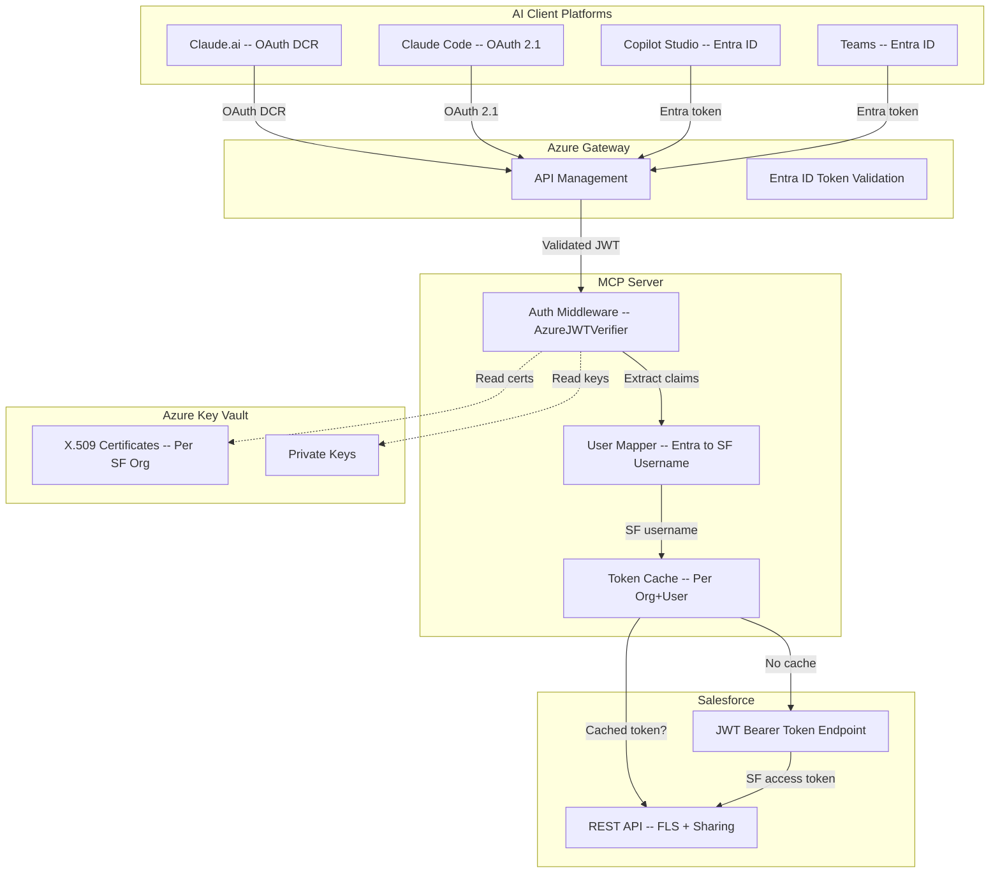
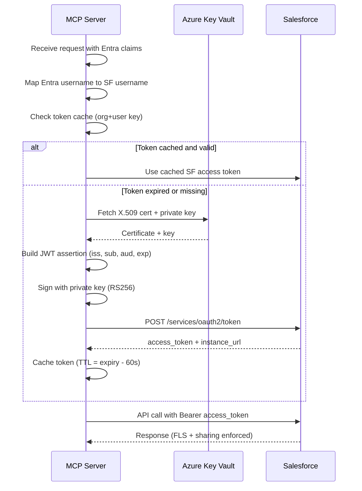
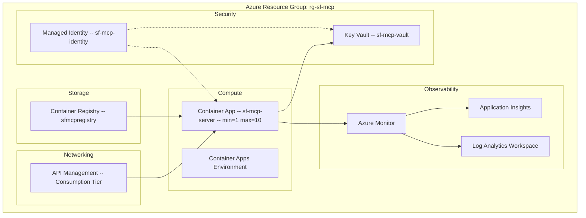

# Salesforce MCP Server -- Architecture & Implementation Plan

> **Version:** 1.0.0 | **Date:** 2026-03-27 | **Status:** Draft for Team Review
> **Authors:** Architecture Team (Oracle Research Synthesis)

---

## Table of Contents

1. [Executive Summary](#1-executive-summary)
2. [System Architecture](#2-system-architecture)
3. [Technology Stack](#3-technology-stack)
4. [Authentication Architecture](#4-authentication-architecture)
5. [Tool Catalog by Department](#5-tool-catalog-by-department)
6. [Skills & Plugins Design](#6-skills--plugins-design)
7. [Azure Infrastructure](#7-azure-infrastructure)
8. [Implementation Roadmap](#8-implementation-roadmap)
9. [Security Model](#9-security-model)
10. [Rate Limit Strategy](#10-rate-limit-strategy)
11. [Risk Matrix](#11-risk-matrix)
12. [Decision Matrix](#12-decision-matrix)
13. [Appendix: Code Examples](#13-appendix-code-examples)

---

## 1. Executive Summary

We are building a **custom MCP (Model Context Protocol) server** that gives AI assistants -- across Claude, Copilot Studio, Teams, and Cowork -- secure, governed access to our Salesforce CRM data. One server, one endpoint, every department.

**Why custom?** Salesforce own hosted MCP (Beta/GA) covers basic CRUD. It does not cover department-specific analytics, Bulk API operations, Entra ID integration, multi-org support, or the tool governance our security posture requires. Our server fills those gaps while complementing -- not replacing -- what Salesforce ships.

**Key design decisions:**

- **FastMCP (Python 3.12+)** -- decorator-based tool definitions, built-in Azure auth, Streamable HTTP transport
- **Azure Container Apps** -- serverless compute with auto-TLS, KEDA autoscaling, free-tier-friendly for dev
- **Azure API Management** -- unified gateway handling both Claude OAuth DCR and Microsoft Entra ID behind one URL
- **Per-user Salesforce access** -- JWT Bearer Token flow preserves SF field-level security and sharing rules per user
- **40+ tools** organized by department, exposed selectively via Entra ID group-to-permission mapping

**Cost envelope:** $0-5/mo (dev), $15-30/mo (light production), $50-100/mo (medium), $200-500/mo (heavy with APIM).

**Timeline:** 4 phases over ~12 weeks. Phase 1 (Core + Auth + Universal tools) delivers value in 3 weeks.


---

## 2. System Architecture

### High-Level Architecture

```
+-------------------------------------------------------------------------+
|                          AI CLIENT PLATFORMS                             |
|                                                                         |
|  +----------+  +----------+  +----------+  +----------+  +----------+  |
|  |Claude.ai |  |Claude    |  | Cowork   |  | Copilot  |  |  Teams   |  |
|  |          |  |Code      |  |          |  | Studio   |  |  (SDK v2)|  |
|  +----+-----+  +----+-----+  +----+-----+  +----+-----+  +----+-----+  |
|       |              |              |              |              |      |
|       |   OAuth DCR  |  OAuth 2.1   |  OAuth 2.0   |  Entra ID    |    |
|       +--------------+--------------+------+-------+--------------+    |
+--------------------------------------------+----------------------------+
                                             |
                                             v
                    +----------------------------------------+
                    |     Azure API Management (Gateway)      |
                    |                                         |
                    |  - OAuth DCR endpoint (Claude)          |
                    |  - Entra ID validation (Microsoft)      |
                    |  - Rate limiting (per-client, per-user) |
                    |  - Request routing and analytics        |
                    +--------------------+-------------------+
                                         |
                                         v
                    +----------------------------------------+
                    |    Azure Container Apps (Compute)       |
                    |                                         |
                    |  +-----------------------------------+  |
                    |  |   FastMCP Server (Python 3.12)     |  |
                    |  |                                    |  |
                    |  |  +-----------+  +-------------+   |  |
                    |  |  | Tool      |  | Auth        |   |  |
                    |  |  | Registry  |  | Middleware   |   |  |
                    |  |  | (40+)     |  | (JWT/OIDC)  |   |  |
                    |  |  +-----------+  +-------------+   |  |
                    |  |  +-----------+  +-------------+   |  |
                    |  |  | SF Client |  | Rate Limit  |   |  |
                    |  |  | Pool      |  | Manager     |   |  |
                    |  |  +-----------+  +-------------+   |  |
                    |  +-----------------------------------+  |
                    +--------------------+-------------------+
                                         |
                            +------------+------------+
                            v            v            v
                    +----------+  +----------+  +----------+
                    | Azure    |  |Salesforce|  | Azure    |
                    | Key Vault|  | REST API |  | Monitor  |
                    |          |  | + SOQL   |  | + OTel   |
                    | - Certs  |  | + Bulk   |  |          |
                    | - Keys   |  | + Reports|  | - Logs   |
                    | - Secrets|  | + CDC    |  | - Metrics|
                    +----------+  +----------+  +----------+
```

### Request Flow (Simplified)

```
User asks AI: "What is my pipeline looking like?"
        |
        v
AI Platform --Streamable HTTP--> APIM Gateway
        |                            |
        |                     Validates OAuth/Entra token
        |                     Extracts user identity
        |                     Applies rate limit
        |                            |
        |                            v
        |                     FastMCP Server
        |                            |
        |                     1. Auth middleware: extract Entra claims
        |                     2. Map Entra user to SF username
        |                     3. JWT Bearer flow to SF access token
        |                     4. Execute query_pipeline tool
        |                     5. SF enforces FLS/sharing per user
        |                            |
        |                            v
        |                     Salesforce returns filtered data
        |                            |
        <----------------------------+
AI formats response for user
```


---

## 3. Technology Stack

| Layer | Technology | Version | Purpose |
|-------|-----------|---------|---------|
| **Framework** | FastMCP | 3.1.1+ | MCP server framework (Python) |
| **Language** | Python | 3.12+ | Server implementation |
| **Transport** | Streamable HTTP | MCP spec | Client-server communication (SSE deprecated) |
| **Compute** | Azure Container Apps | -- | Serverless container hosting |
| **Gateway** | Azure API Management | -- | Auth unification, rate limiting, analytics |
| **Secrets** | Azure Key Vault | -- | SF certificates, private keys, client secrets |
| **Observability** | Azure Monitor + OpenTelemetry | -- | Logging, metrics, tracing |
| **Auth (Identity)** | Entra ID (Azure AD) | -- | User identity, group-based permissions |
| **Auth (SF)** | JWT Bearer Token + Client Credentials | -- | Per-user and system SF access |
| **SF Client** | simple-salesforce / httpx | -- | Salesforce REST API client |
| **Caching** | In-memory (dict/TTLCache) | -- | Metadata cache (24h TTL) |
| **Container** | Docker | -- | Packaging and deployment |
| **CI/CD** | GitHub Actions | -- | Build, test, deploy pipeline |

---

## 4. Authentication Architecture

Authentication is the most complex part of this system. Three distinct auth domains must interoperate: the AI client platform, Entra ID (our identity provider), and Salesforce.

### 4.1 Authentication Flow Overview



### 4.2 Claude Platform Auth (OAuth DCR)

Claude.ai uses **Dynamic Client Registration (RFC 7591)**. The MCP server must expose a registration endpoint.

```
Claude.ai                    APIM                      MCP Server
    |                          |                            |
    |-- POST /register ------->|----------------------------+
    |                          |     DCR: create client_id   |
    |<-- client_id, secret ----|<---------------------------+
    |                          |                            |
    |-- GET /authorize ------->|-- Redirect to Entra ID --->|
    |-- User logs in --------->|-- Entra ID validates ----->|
    |<-- authorization_code ---|<---------------------------+
    |                          |                            |
    |-- POST /token ---------->|----------------------------+
    |                          |  Exchange code for tokens   |
    |<-- access_token ---------|<---------------------------+
    |                          |                            |
    |-- MCP request ---------->|-- Validate token --------->|
    |   (Bearer token)         |   Extract user claims       |
    |                          |   Map to SF username        |
    |                          |   JWT Bearer to SF token    |
    |<-- MCP response ---------|<---------------------------+
```

### 4.3 Microsoft Platform Auth (Entra ID)

Copilot Studio, Teams, and M365 Copilot send Entra ID tokens natively.

```
Teams/Copilot Studio         APIM                      MCP Server
    |                          |                            |
    |-- MCP request ---------->|                            |
    |   (Entra bearer token)   |-- Validate Entra JWT ----->|
    |                          |   (iss, aud, exp, sig)      |
    |                          |-- Extract claims ---------->|
    |                          |   preferred_username         |
    |                          |   groups[]                   |
    |                          |   tid (tenant ID)            |
    |                          |-- Map user to SF username ->|
    |                          |-- JWT Bearer to SF token -->|
    |                          |-- Execute tool ------------>|
    |<-- MCP response ---------|<---------------------------+
```

### 4.4 Salesforce JWT Bearer Token Flow

This is the critical bridge between Entra ID identity and Salesforce access.



### 4.5 Auth Configuration Summary

| Flow | Use Case | SF Auth Method | Credentials |
|------|----------|---------------|-------------|
| **Per-user (interactive)** | All user-facing tools | JWT Bearer Token | X.509 cert per org (Key Vault) |
| **System ops** | Background jobs, bulk ops | Client Credentials | Integration user credentials |
| **Admin ops** | Metadata, user management | Client Credentials | Admin integration user |

### 4.6 Permission Model

Entra ID groups determine which MCP tools a user can invoke:

| Entra ID Group | SF Permission Set | Available Tool Categories |
|----------------|------------------|--------------------------|
| SG-SF-Sales | Sales_MCP_User | Sales + Universal |
| SG-SF-Marketing | Marketing_MCP_User | Marketing + Universal |
| SG-SF-Support | Support_MCP_User | Support/Success + Universal |
| SG-SF-Ops | Ops_MCP_Admin | Ops/Admin + Universal |
| SG-SF-Exec | Executive_MCP_User | Executive + Universal + cross-object |
| SG-SF-Admin | SF_MCP_Full | All tools |

FastMCP enforces this with RequireScope:

```python
@mcp.tool(dependencies=[RequireScope("sf.sales.read")])
async def query_pipeline(ctx: Context, ...) -> str:
    ...
```


---

## 5. Tool Catalog by Department

### 5.1 Sales Tools (8)

| Tool | MCP Type | SF API | Description |
|------|----------|--------|-------------|
| query_pipeline | tool | SOQL | Query opportunities by stage, owner, date range; returns pipeline summary |
| get_forecast | tool | Reports API | Retrieve forecast data by period, team, or territory |
| search_accounts | tool | SOSL | Full-text search across Account fields |
| get_opportunity_details | tool | REST (GET) | Full opportunity record with related contacts, activities, products |
| log_activity | tool | REST (POST) | Create Task or Event linked to a record |
| get_lead_queue | tool | SOQL | Query lead queue by status, source, score, owner |
| update_opportunity_stage | tool | REST (PATCH) | Move opportunity to next stage with validation |
| run_pipeline_report | tool | Reports API | Execute a saved pipeline report with optional filters |

### 5.2 Marketing Tools (5)

| Tool | MCP Type | SF API | Description |
|------|----------|--------|-------------|
| get_campaign_performance | tool | SOQL + Reports | Campaign metrics: responses, conversions, ROI |
| search_leads_by_score | tool | SOQL | Query leads filtered by score range, source, status |
| add_to_campaign | tool | REST (POST) | Add lead/contact as campaign member |
| get_campaign_roi | tool | Reports API | Campaign cost vs. revenue attribution |
| list_active_campaigns | tool | SOQL | Active campaigns with member counts and status |

### 5.3 Support and Success Tools (7)

| Tool | MCP Type | SF API | Description |
|------|----------|--------|-------------|
| create_case | tool | REST (POST) | Create support case with required field validation |
| search_cases | tool | SOSL/SOQL | Search cases by keyword, status, priority, account |
| get_case_details | tool | REST (GET) | Full case with comments, attachments, escalation history |
| search_knowledge | tool | SOSL | Search Knowledge articles for resolution |
| get_entitlements | tool | SOQL | Check account support entitlements and SLA |
| get_support_metrics | tool | Reports API | Case volume, CSAT, resolution time metrics |
| escalate_case | tool | REST (PATCH) | Escalate case priority with reason logging |

### 5.4 Ops and Admin Tools (8)

| Tool | MCP Type | SF API | Description |
|------|----------|--------|-------------|
| describe_object | tool | Describe API | Object metadata: fields, types, relationships |
| get_org_limits | tool | Limits API | Current API usage vs. limits |
| query_users | tool | SOQL | List/search active users, profiles, roles |
| run_data_quality_report | tool | SOQL | Find records with missing required fields |
| get_automation_status | tool | Metadata API | Status of flows, triggers, process builders |
| bulk_update | tool | Bulk 2.0 API | Update up to 10K records via CSV ingest |
| export_records | tool | Bulk 2.0 API | Export query results as CSV (async) |
| get_custom_objects | tool | Describe Global | List all custom objects with record counts |

### 5.5 Executive Tools (5)

| Tool | MCP Type | SF API | Description |
|------|----------|--------|-------------|
| run_report | tool | Reports API | Execute any saved report by ID or name |
| get_dashboard | tool | Dashboards API | Retrieve dashboard component data |
| cross_object_query | tool | SOQL (joins) | Complex queries spanning multiple objects |
| get_kpis | tool | Composite API | Fetch multiple KPI values in one call |
| trend_analysis | tool | Reports API | Compare metrics across time periods |

### 5.6 Universal Tools (9)

| Tool | MCP Type | SF API | Description |
|------|----------|--------|-------------|
| soql_query | tool | SOQL | Execute arbitrary SOQL (with injection prevention) |
| search | tool | SOSL | Full-text search across objects |
| get_record | tool | REST (GET) | Retrieve any record by ID |
| create_record | tool | REST (POST) | Create any record with field validation |
| update_record | tool | REST (PATCH) | Update any record by ID |
| delete_record | tool | REST (DELETE) | Soft-delete record (with confirmation prompt) |
| get_recent_items | tool | Recent Items API | User recently viewed records |
| describe_fields | resource | Describe API | MCP resource: field metadata for an object |
| list_objects | resource | Describe Global | MCP resource: available SF objects |

### 5.7 Tool Count Summary

| Department | Tools | Resources | Total |
|------------|-------|-----------|-------|
| Sales | 8 | 0 | 8 |
| Marketing | 5 | 0 | 5 |
| Support/Success | 7 | 0 | 7 |
| Ops/Admin | 8 | 0 | 8 |
| Executive | 5 | 0 | 5 |
| Universal | 7 | 2 | 9 |
| **Total** | **40** | **2** | **42** |


---

## 6. Skills and Plugins Design

### 6.1 What Are Skills?

Skills are lightweight prompt templates that wrap MCP tools with domain context, validation, and workflow orchestration. They live as .claude/skills/*/SKILL.md files and are loaded by Claude Code when triggered by keywords or explicit invocation.

Skills do not contain code -- they contain instructions that teach the AI *how* to use the MCP tools effectively for a specific persona or workflow.

### 6.2 Department Skill Architecture

```
.claude/skills/
  salesforce/
    SKILL.md                  # Router skill (keyword detection to sub-skill)
    references/
      sales-playbook.md       # Sales team workflows
      marketing-ops.md        # Marketing team workflows
      support-runbook.md      # Support team workflows
      admin-guide.md          # Ops/Admin workflows
      executive-briefing.md   # Executive workflows
      soql-patterns.md        # Common SOQL patterns and anti-patterns
```

### 6.3 Example Skill: Sales Playbook

```markdown
# Salesforce Sales Playbook -- SKILL.md

## Triggers
Keywords: pipeline, forecast, opportunity, deal, quota, sales report

## Available Tools
- query_pipeline -- Pipeline analysis
- get_forecast -- Forecast data
- search_accounts -- Account lookup
- get_opportunity_details -- Deal deep-dive
- log_activity -- Log calls/meetings
- update_opportunity_stage -- Stage progression
- run_pipeline_report -- Saved reports

## Workflows

### "How is my pipeline?"
1. Call query_pipeline with current quarter dates, owner=current user
2. Summarize by stage: count, total value, weighted value
3. Flag deals closing this month without recent activity
4. Suggest: "Want me to check forecast alignment?"

### "Update deal stage"
1. Call get_opportunity_details to show current state
2. Confirm new stage with user
3. Call update_opportunity_stage
4. Call log_activity to record the stage change reason

### Validation Rules
- NEVER update stage backward without explicit confirmation
- ALWAYS show current values before modification
- Flag opportunities with no activity in 30+ days as "at risk"
```

### 6.4 Example Skill: Executive Briefing

```markdown
# Salesforce Executive Briefing -- SKILL.md

## Triggers
Keywords: KPI, dashboard, executive summary, business review, quarterly numbers

## Available Tools
- run_report -- Execute saved reports
- get_dashboard -- Dashboard data
- get_kpis -- Multiple KPIs in one call
- cross_object_query -- Complex joins
- trend_analysis -- Period comparisons

## Workflows

### "Give me a business snapshot"
1. Call get_kpis for: open pipeline, closed-won MTD, new leads MTD, open cases
2. Call trend_analysis comparing current month vs. prior month
3. Format as executive summary with arrows (up/down/flat)
4. Offer: "Want me to drill into any of these numbers?"

### Formatting Rules
- Use tables for multi-metric summaries
- Always include period-over-period comparison
- Round currency to nearest 1K for readability
- Flag metrics that are >10% below target
```

### 6.5 Plugin Distribution Model

For distributing to teams outside Claude Code (Copilot Studio, Teams):

```
salesforce-mcp-plugin/
  plugin.json              # Plugin manifest (tools, resources, prompts)
  skills/
    sales.md
    marketing.md
    support.md
    admin.md
    executive.md
  prompts/
    pipeline-review.md     # MCP prompt templates
    case-triage.md
    data-quality-check.md
  configs/
    claude-code.json       # Claude Code MCP config
    copilot-studio.json    # Copilot Studio connector config
    teams-app.json         # Teams app manifest
```


---

## 7. Azure Infrastructure

### 7.1 Deployment Topology



### 7.2 Container Apps Configuration

```yaml
# container-app.yaml
properties:
  configuration:
    activeRevisionsMode: Single
    ingress:
      external: true
      targetPort: 8000
      transport: http
      corsPolicy:
        allowedOrigins: ["*"]  # Tighten for production
    secrets:
      - name: kv-url
        keyVaultUrl: https://sf-mcp-vault.vault.azure.net/
    registries:
      - server: sfmcpregistry.azurecr.io
        identity: system
  template:
    containers:
      - name: sf-mcp-server
        image: sfmcpregistry.azurecr.io/sf-mcp:latest
        resources:
          cpu: 0.5
          memory: 1Gi
        env:
          - name: AZURE_KEY_VAULT_URL
            secretRef: kv-url
          - name: AZURE_TENANT_ID
            value: "<tenant-id>"
          - name: SF_LOGIN_URL
            value: "https://login.salesforce.com"
    scale:
      minReplicas: 1
      maxReplicas: 10
      rules:
        - name: http-scaling
          http:
            metadata:
              concurrentRequests: "50"
```

### 7.3 Cost Breakdown

| Resource | Tier | Dev ($/mo) | Light Prod ($/mo) | Medium Prod ($/mo) | Heavy Prod ($/mo) |
|----------|------|-----------|-------------------|--------------------|--------------------|
| Container Apps | Consumption | /usr/bin/bash (free tier) | -10 | 0-40 | 0-100 |
| API Management | Consumption | /usr/bin/bash (free tier) | -10 | 5-30 | 00-300 |
| Key Vault | Standard | /usr/bin/bash.03 | /usr/bin/bash.50 |  |  |
| Container Registry | Basic |  |  |  |  |
| Monitor / App Insights | Pay-as-you-go | /usr/bin/bash | -5 | 0-20 | 0-50 |
| Log Analytics | Pay-as-you-go | /usr/bin/bash | -3 | -10 | 5-40 |
| **Total** | | **/usr/bin/bash-5** | **5-30** | **0-100** | **00-500** |

**Free tier details:**
- Container Apps: 180K vCPU-seconds/mo, 360K GiB-seconds/mo
- API Management Consumption: 1M calls/mo free
- Key Vault: 10K operations/mo free

### 7.4 Scaling Strategy

| Metric | Threshold | Action |
|--------|-----------|--------|
| Concurrent requests | >50 per replica | Scale out (+1 replica) |
| CPU utilization | >70% | Scale out |
| Response latency (p95) | >2 seconds | Scale out |
| Min replicas (prod) | 1 | Prevent cold starts |
| Max replicas | 10 | Cost ceiling |


---

## 8. Implementation Roadmap

### Phase 1: Foundation (Weeks 1-3)

**Goal:** Working MCP server with auth and universal tools, deployed to Azure, accessible from Claude Code.

| Task | Deliverable | Effort |
|------|------------|--------|
| Project scaffolding | FastMCP project structure, Docker, CI | 2 days |
| Entra ID + APIM setup | Auth gateway, DCR endpoint | 3 days |
| SF JWT Bearer auth | Per-user token flow, Key Vault integration | 3 days |
| Universal tools (9) | soql_query, search, CRUD, describe | 4 days |
| Deployment pipeline | Container Apps + GitHub Actions | 2 days |
| Claude Code integration | MCP config, basic skill file | 1 day |

**Acceptance criteria:**
- [ ] Claude Code can connect to MCP server via Streamable HTTP
- [ ] User identity flows from Entra ID through to Salesforce
- [ ] SF enforces FLS/sharing on API responses
- [ ] All 9 universal tools functional with error handling
- [ ] Deployed to Azure dev environment

### Phase 2: Department Tools (Weeks 4-7)

**Goal:** All 40+ tools implemented and tested, permission model enforced.

| Task | Deliverable | Effort |
|------|------------|--------|
| Sales tools (8) | Pipeline, forecast, lead management | 3 days |
| Marketing tools (5) | Campaign analytics, lead scoring | 2 days |
| Support tools (7) | Case management, knowledge search | 3 days |
| Ops/Admin tools (8) | Bulk API, metadata, data quality | 4 days |
| Executive tools (5) | Reports, dashboards, KPIs | 3 days |
| Permission enforcement | Entra group to scope mapping | 2 days |
| Rate limit manager | Token bucket, Composite API batching | 2 days |

**Acceptance criteria:**
- [ ] All 42 tools/resources functional
- [ ] Permission model tested: users only see tools their Entra groups allow
- [ ] Rate limits tracked, Composite API used where possible
- [ ] Error messages are LLM-friendly (ToolError, not stack traces)

### Phase 3: Skills and Plugins (Weeks 8-10)

**Goal:** Department-specific skills, prompt templates, and plugin packaging.

| Task | Deliverable | Effort |
|------|------------|--------|
| Sales skill + prompts | Pipeline review, deal coaching workflows | 2 days |
| Marketing skill + prompts | Campaign analysis, lead triage | 1 day |
| Support skill + prompts | Case triage, knowledge lookup | 2 days |
| Ops/Admin skill + prompts | Data quality, automation monitoring | 1 day |
| Executive skill + prompts | Business snapshot, trend analysis | 1 day |
| SOQL patterns reference | Common queries, anti-patterns | 1 day |
| Plugin packaging | Distributable bundle with configs | 2 days |

**Acceptance criteria:**
- [ ] Each department has a tested skill with 3+ workflows
- [ ] Skills reduce average tool calls per task by 30%+ (measured)
- [ ] Plugin bundle installs cleanly in Claude Code

### Phase 4: Multi-Client Deployment (Weeks 11-12)

**Goal:** All 5 client platforms connected and tested.

| Task | Deliverable | Effort |
|------|------------|--------|
| Claude.ai integration | OAuth DCR flow tested end-to-end | 2 days |
| Cowork integration | OAuth 2.0 connector config | 1 day |
| Copilot Studio connector | Custom connector, Entra ID auth | 2 days |
| Teams app manifest | Teams SDK v2 integration | 2 days |
| Cross-platform testing | Same user, same data, 5 platforms | 2 days |
| Production hardening | APIM policies, alerting, runbook | 1 day |

**Acceptance criteria:**
- [ ] All 5 platforms connect to one MCP endpoint
- [ ] Same user gets same data regardless of platform
- [ ] Auth works for all platform-specific flows
- [ ] Monitoring and alerting operational

### Roadmap Visual

```
Week:  1    2    3    4    5    6    7    8    9    10   11   12
       |================|
       |  Phase 1       |
       |  Foundation    |
       |  Core+Auth+    |
       |  Universal     |
       |                |=========================|
       |                |  Phase 2                 |
       |                |  Department Tools        |
       |                |  40+ tools + permissions |
       |                |                          |==============|
       |                |                          |  Phase 3     |
       |                |                          |  Skills +    |
       |                |                          |  Plugins     |
       |                |                          |              |==========|
       |                |                          |              | Phase 4  |
       |                |                          |              | Multi-   |
       |                |                          |              | Client   |
       +================+==========================+==============+==========+
```


---

## 9. Security Model

### 9.1 Defense in Depth

```
Layer 1: Azure API Management
  +-- TLS termination (auto-cert)
  +-- OAuth/Entra token validation
  +-- IP restriction (optional)
  +-- Rate limiting (per-client, per-user)
  +-- Request/response logging (sanitized)

Layer 2: FastMCP Auth Middleware
  +-- AzureJWTVerifier (token signature, expiry, audience)
  +-- OIDCProxyAuth with AzureProvider
  +-- TokenClaim extraction (user, groups, tenant)
  +-- RequireScope on every tool
  +-- Entra group to SF permission mapping

Layer 3: Salesforce API Security
  +-- Per-user JWT Bearer token (user own access level)
  +-- Field-Level Security (FLS) enforced by SF
  +-- Sharing rules enforced by SF
  +-- Organization-Wide Defaults (OWD) enforced by SF
  +-- Connected App IP restrictions (Azure IP range only)

Layer 4: Data Handling
  +-- NEVER cache record data (security model bypass risk)
  +-- Cache metadata only (24h TTL, object/field definitions)
  +-- NEVER log record data (PII/confidential)
  +-- Log tool invocations (tool name, user, timestamp)
  +-- Sanitize all error messages before returning to LLM
```

### 9.2 SOQL Injection Prevention

```python
# ALLOWLIST approach -- not escaping
ALLOWED_OBJECTS = {"Account", "Contact", "Opportunity", "Lead", "Case"}
ALLOWED_FIELDS = {}  # Populated from describe cache per object

def validate_soql(query: str, user_objects: set[str]) -> str:
    """Validate SOQL query against allowlists."""
    parsed = parse_soql(query)

    if parsed.object not in ALLOWED_OBJECTS:
        raise ToolError(f"Object '{parsed.object}' is not available.")

    if parsed.object not in user_objects:
        raise ToolError(f"You do not have access to '{parsed.object}'.")

    for field in parsed.fields:
        if field not in ALLOWED_FIELDS.get(parsed.object, set()):
            raise ToolError(f"Field '{field}' not found on {parsed.object}.")

    # Escape string literals in WHERE clause
    for literal in parsed.string_literals:
        if "'" in literal or "\" in literal:
            raise ToolError("Invalid characters in query value.")

    return query
```

### 9.3 Credential Management

| Secret | Storage | Rotation | Access |
|--------|---------|----------|--------|
| SF X.509 certificates | Key Vault (per org) | Annual | Managed Identity |
| SF private keys | Key Vault (per org) | Annual | Managed Identity |
| Entra client secret | Key Vault | 6 months | Managed Identity |
| APIM subscription keys | APIM built-in | 90 days | Per-client |
| SF access tokens | In-memory cache | Per-token expiry | Never persisted |

### 9.4 Compliance Checklist

- [ ] All data in transit encrypted (TLS 1.2+)
- [ ] No record data cached or logged
- [ ] PII never returned in error messages
- [ ] Per-user auth preserves SF security model
- [ ] Audit trail: who invoked what tool, when (no data content)
- [ ] IP restrictions on SF Connected Apps
- [ ] Managed Identity for all Azure-to-Azure auth (no stored passwords)
- [ ] Key Vault soft-delete and purge protection enabled


---

## 10. Rate Limit Strategy

### 10.1 Salesforce API Limits

| Limit Type | Allocation (Enterprise, ~200 users) | Strategy |
|------------|-------------------------------------|----------|
| REST API calls/day | 100,000 - 300,000 | Track via Sforce-Limit-Info header |
| Concurrent API calls | 25 | Connection pool limit |
| Async report runs/hr | 1,200 | Queue with backpressure |
| Bulk 2.0 batches/day | 15,000 | Batch coalescing |
| SOQL query rows/request | 50,000 | Pagination |
| SOQL query timeout | 120 seconds | Query optimization |

### 10.2 Three-Layer Rate Management

```
Layer 1: Proactive -- Reduce API calls
  +-- Composite API: batch up to 25 subrequests per call (3-5x reduction)
  +-- Metadata cache: 24h TTL for describe/fields (eliminates repeated calls)
  +-- Query optimization: SELECT only needed fields, use indexed WHERE clauses
  +-- Bulk 2.0 for >200 record operations

Layer 2: Tracking -- Know your budget
  +-- Parse Sforce-Limit-Info header on EVERY response
  +-- Track usage per org: current / max, percentage consumed
  +-- Expose via get_org_limits tool (self-service visibility)
  +-- Alert at 70% and 90% thresholds

Layer 3: Reactive -- Degrade gracefully
  +-- Circuit breaker: open after 5 consecutive 429/503 responses
  +-- Exponential backoff: 1s, 2s, 4s, 8s (max 30s, 3 retries)
  +-- Rate limit per user: prevent one user from consuming all budget
  +-- Graceful degradation: disable non-critical tools before critical ones
```

### 10.3 Circuit Breaker Configuration

```python
CIRCUIT_BREAKER_CONFIG = {
    "failure_threshold": 5,       # Consecutive failures before opening
    "reset_timeout_seconds": 30,  # Time before half-open
    "half_open_max_calls": 1,     # Requests allowed in half-open state
    "monitored_exceptions": [
        SalesforceRateLimitError,
        SalesforceServiceUnavailable,
    ],
}
```

### 10.4 Composite API Usage

```python
# Instead of 5 separate API calls:
#   GET /Account/001xx
#   GET /Contact/003xx
#   GET /Opportunity/006xx
#   GET /Task?q=...
#   GET /Event?q=...

# One Composite call:
composite_request = {
    "compositeRequest": [
        {
            "method": "GET",
            "url": "/services/data/v62.0/sobjects/Account/001xx",
            "referenceId": "account",
        },
        {
            "method": "GET",
            "url": "/services/data/v62.0/sobjects/Contact/003xx",
            "referenceId": "contact",
        },
        {
            "method": "GET",
            "url": "/services/data/v62.0/sobjects/Opportunity/006xx",
            "referenceId": "opp",
        },
        {
            "method": "GET",
            "url": "/services/data/v62.0/query?q=SELECT+Id,Subject+FROM+Task+WHERE+WhatId=006xx+LIMIT+10",
            "referenceId": "tasks",
        },
        {
            "method": "GET",
            "url": "/services/data/v62.0/query?q=SELECT+Id,Subject+FROM+Event+WHERE+WhatId=006xx+LIMIT+10",
            "referenceId": "events",
        },
    ]
}
# 1 API call instead of 5. Same daily budget, 5x the throughput.
```


---

## 11. Risk Matrix

| # | Risk | Severity | Likelihood | Impact | Mitigation |
|---|------|----------|------------|--------|------------|
| 1 | **SF API rate limit exhaustion** | HIGH | Medium | Service degradation for all users | Composite API, caching, per-user quotas, circuit breaker, monitoring at 70%/90% |
| 2 | **JWT cert expiration** | CRITICAL | Low (if monitored) | Complete auth failure | Key Vault alerts at 30/7/1 day before expiry, automated rotation runbook |
| 3 | **Entra ID outage** | HIGH | Low | No new auth tokens | Token caching (existing sessions continue), fallback to cached group mappings |
| 4 | **SOQL injection via LLM** | CRITICAL | Medium | Unauthorized data access | Allowlist objects/fields, escape strings, never build SOQL from raw user input |
| 5 | **Data leakage via LLM context** | HIGH | Medium | PII in AI conversation history | Per-user JWT (SF enforces FLS), never cache records, sanitize error messages |
| 6 | **Cold start latency** | MEDIUM | Medium | First request slow (3-5s) | minReplicas=1 in production, connection warmup on startup |
| 7 | **Multi-org complexity** | MEDIUM | High | Config sprawl, cert management | Per-org config in Key Vault, org registry pattern, automated validation |
| 8 | **Claude DCR compatibility** | MEDIUM | Medium | Claude.ai cannot connect | APIM handles DCR, test with Claude beta MCP connector early |
| 9 | **SF schema changes** | LOW | Medium | Tools break on field/object rename | Metadata cache refresh, describe-based field discovery, not hardcoded fields |
| 10 | **Cost overrun** | LOW | Low | Unexpected Azure bill | Budget alerts, APIM rate limiting, autoscale max ceiling |

---

## 12. Decision Matrix

These are decisions the team needs to make in or before the architecture meeting.

| # | Decision | Options | Recommendation | Needs Input From |
|---|----------|---------|----------------|------------------|
| 1 | **Single-org or multi-org from day 1?** | A) Single org, add multi-org later. B) Multi-org architecture from start. | **A) Single org first** -- reduces Phase 1 complexity by ~40%. Multi-org is additive (new certs in Key Vault, new config entries). | SF Admin, IT |
| 2 | **APIM from day 1 or add later?** | A) Direct to Container Apps (simpler). B) APIM gateway from start. | **B) APIM from start** -- Claude DCR and Microsoft Entra ID require different auth handling. APIM unifies this cleanly. Adding later means re-wiring all clients. | DevOps |
| 3 | **soql_query tool: free-form or restricted?** | A) Accept any SOQL (with validation). B) Parameterized queries only (object, fields, filters). | **A) Free-form with allowlist validation** -- LLMs are effective SOQL generators. Restricting to parameterized kills the natural-language-to-data value prop. Allowlist prevents injection. | Security, SF Admin |
| 4 | **delete_record tool: include or exclude?** | A) Include with confirmation prompt. B) Exclude entirely (update-only). | **B) Exclude from v1** -- soft-delete is rarely needed via AI, high risk. Add in v2 after usage patterns are understood. | Business stakeholders |
| 5 | **User-to-SF mapping method** | A) Email match (Entra email = SF email). B) Custom attribute mapping. C) Mapping table in config. | **A) Email match** unless SF usernames diverge from email. Simplest, works for 90% of orgs. | SF Admin, IT |
| 6 | **Bulk API access: who gets it?** | A) Ops/Admin only. B) Ops/Admin + Executive. C) All departments. | **A) Ops/Admin only** -- Bulk operations can move large data volumes. Restrict to trained users initially. | Security, Ops |
| 7 | **Development environment** | A) SF sandbox + Azure dev. B) SF Developer Edition + Azure dev. C) Shared SF sandbox only. | **A) SF sandbox + Azure dev** -- mirrors production topology. Developer Edition lacks features we need. | SF Admin, Budget |
| 8 | **Monitoring: who sees what?** | A) Central IT dashboard only. B) Per-department usage dashboards. C) Both. | **C) Both** -- IT needs operational visibility, department leads need usage/adoption metrics. Azure Monitor supports both. | IT, Department leads |


---

## 13. Appendix: Code Examples

### 13.1 FastMCP Server Setup

```python
# server.py
import os
import json
from contextlib import asynccontextmanager
from dataclasses import dataclass

from fastmcp import FastMCP, Context
from fastmcp.server.auth import OIDCProxyAuth, AzureProvider
from fastmcp.server.dependencies import RequireScope, TokenClaim


# -- Auth Configuration --
azure_auth = OIDCProxyAuth(
    provider=AzureProvider(
        tenant_id=os.environ["AZURE_TENANT_ID"],
        client_id=os.environ["AZURE_CLIENT_ID"],
    )
)


# -- Lifespan: shared resources --
@dataclass
class AppContext:
    sf_client_pool: "SalesforceClientPool"
    metadata_cache: "MetadataCache"
    rate_limiter: "RateLimitManager"


@asynccontextmanager
async def app_lifespan(server: FastMCP):
    """Initialize shared resources on startup, clean up on shutdown."""
    from sf_client import SalesforceClientPool
    from cache import MetadataCache
    from rate_limit import RateLimitManager

    pool = SalesforceClientPool(
        key_vault_url=os.environ["AZURE_KEY_VAULT_URL"],
        login_url=os.environ.get("SF_LOGIN_URL", "https://login.salesforce.com"),
    )
    cache = MetadataCache(ttl_seconds=86400)  # 24h
    limiter = RateLimitManager()

    await pool.initialize()
    await cache.warm_up(pool)

    try:
        yield AppContext(
            sf_client_pool=pool,
            metadata_cache=cache,
            rate_limiter=limiter,
        )
    finally:
        await pool.close()


# -- Server --
mcp = FastMCP(
    "Salesforce MCP",
    auth=azure_auth,
    lifespan=app_lifespan,
)
```

### 13.2 Universal Tool: soql_query

```python
# tools/universal.py
import json
from fastmcp import Context
from fastmcp.exceptions import ToolError
from fastmcp.server.dependencies import RequireScope, TokenClaim

from validation import validate_soql, SOQLValidationError
from sf_client import SalesforceError


@mcp.tool(dependencies=[RequireScope("sf.query.read")])
async def soql_query(
    query: str,
    ctx: Context,
    user_email: str = TokenClaim("preferred_username"),
    tenant_id: str = TokenClaim("tid"),
) -> str:
    """Execute a SOQL query against Salesforce.

    Args:
        query: A valid SOQL query string. Example:
               SELECT Id, Name, Amount FROM Opportunity
               WHERE StageName = 'Closed Won' LIMIT 10

    Returns:
        JSON string with query results including totalSize and records array.

    Raises:
        ToolError if query is invalid, user lacks access, or SF returns an error.
    """
    app: AppContext = ctx.request_context.lifespan_context

    # Validate SOQL against allowlists
    try:
        user_objects = await app.metadata_cache.get_user_objects(user_email)
        validated_query = validate_soql(query, user_objects)
    except SOQLValidationError as e:
        raise ToolError(str(e))

    # Check rate limits
    if not app.rate_limiter.allow(tenant_id, user_email):
        raise ToolError(
            "Rate limit reached. Try again in a few minutes, "
            "or ask me to check your org API usage with get_org_limits."
        )

    # Execute against SF with per-user JWT token
    try:
        sf = await app.sf_client_pool.get_client(
            tenant_id=tenant_id,
            user_email=user_email,
        )
        result = await sf.query(validated_query)

        # Track API usage from response headers
        app.rate_limiter.update_from_headers(tenant_id, sf.last_response_headers)

        return json.dumps(
            {
                "totalSize": result["totalSize"],
                "records": result["records"],
                "done": result["done"],
            },
            indent=2,
            default=str,
        )

    except SalesforceError as e:
        if e.status == 401:
            # Token expired -- clear cache, suggest retry
            app.sf_client_pool.invalidate(tenant_id, user_email)
            raise ToolError("Salesforce session expired. Please try again.")
        raise ToolError(f"Salesforce error: {e.message}")
```


### 13.3 Department Tool: query_pipeline

```python
# tools/sales.py
import json
from fastmcp import Context
from fastmcp.exceptions import ToolError
from fastmcp.server.dependencies import RequireScope, TokenClaim

from validation import escape_soql


@mcp.tool(dependencies=[RequireScope("sf.sales.read")])
async def query_pipeline(
    ctx: Context,
    owner: str | None = None,
    stage: str | None = None,
    close_date_from: str | None = None,
    close_date_to: str | None = None,
    min_amount: float | None = None,
    user_email: str = TokenClaim("preferred_username"),
    tenant_id: str = TokenClaim("tid"),
) -> str:
    """Query the sales pipeline with optional filters.

    Returns opportunities grouped by stage with count, total value,
    and weighted value. Defaults to current user pipeline if no
    owner specified.

    Args:
        owner: Filter by opportunity owner name (partial match).
        stage: Filter by stage name (exact match).
        close_date_from: Earliest close date (YYYY-MM-DD).
        close_date_to: Latest close date (YYYY-MM-DD).
        min_amount: Minimum opportunity amount.

    Returns:
        JSON with pipeline summary by stage and individual opportunity details.
    """
    app: AppContext = ctx.request_context.lifespan_context

    # Build SOQL with parameterized filters
    conditions = ["IsClosed = false"]

    if owner:
        conditions.append(f"Owner.Name LIKE '%{escape_soql(owner)}%'")
    else:
        conditions.append(f"Owner.Email = '{escape_soql(user_email)}'")

    if stage:
        conditions.append(f"StageName = '{escape_soql(stage)}'")
    if close_date_from:
        conditions.append(f"CloseDate >= {close_date_from}")
    if close_date_to:
        conditions.append(f"CloseDate <= {close_date_to}")
    if min_amount is not None:
        conditions.append(f"Amount >= {float(min_amount)}")

    query = (
        "SELECT Id, Name, StageName, Amount, CloseDate, Probability, "
        "Owner.Name, Account.Name, LastActivityDate "
        "FROM Opportunity "
        f"WHERE {' AND '.join(conditions)} "
        "ORDER BY CloseDate ASC "
        "LIMIT 200"
    )

    sf = await app.sf_client_pool.get_client(tenant_id, user_email)
    result = await sf.query(query)

    # Aggregate by stage
    stages = {}
    for opp in result["records"]:
        stage_name = opp["StageName"]
        if stage_name not in stages:
            stages[stage_name] = {
                "count": 0, "total": 0.0, "weighted": 0.0, "opps": []
            }
        stages[stage_name]["count"] += 1
        amount = opp.get("Amount") or 0
        prob = (opp.get("Probability") or 0) / 100
        stages[stage_name]["total"] += amount
        stages[stage_name]["weighted"] += amount * prob
        stages[stage_name]["opps"].append({
            "name": opp["Name"],
            "amount": amount,
            "close_date": opp["CloseDate"],
            "account": opp.get("Account", {}).get("Name", "N/A"),
        })

    return json.dumps({
        "summary": {
            "total_opportunities": result["totalSize"],
            "total_value": sum(s["total"] for s in stages.values()),
            "weighted_value": sum(s["weighted"] for s in stages.values()),
        },
        "by_stage": stages,
    }, indent=2, default=str)
```


### 13.4 Salesforce Client Pool (JWT Bearer Auth)

```python
# sf_client.py
import json
import time
from typing import Any

import jwt
import httpx
from azure.identity.aio import DefaultAzureCredential
from azure.keyvault.secrets.aio import SecretClient


class SalesforceAuthError(Exception):
    pass


class SalesforceError(Exception):
    def __init__(self, status: int, message: str):
        self.status = status
        self.message = message
        super().__init__(message)


class SFClient:
    """Lightweight Salesforce API client."""

    def __init__(self, http: httpx.AsyncClient, token: str, instance_url: str):
        self._http = http
        self._token = token
        self._instance_url = instance_url
        self.last_response_headers: dict = {}

    async def query(self, soql: str) -> dict[str, Any]:
        resp = await self._http.get(
            f"{self._instance_url}/services/data/v62.0/query",
            params={"q": soql},
            headers={"Authorization": f"Bearer {self._token}"},
        )
        self.last_response_headers = dict(resp.headers)
        if resp.status_code != 200:
            raise SalesforceError(resp.status_code, resp.text)
        return resp.json()


class SalesforceClientPool:
    """Manages per-user Salesforce connections using JWT Bearer auth."""

    def __init__(self, key_vault_url: str, login_url: str):
        self.key_vault_url = key_vault_url
        self.login_url = login_url
        self._credential = DefaultAzureCredential()
        self._secret_client = SecretClient(key_vault_url, self._credential)
        self._token_cache: dict[str, tuple[str, str, float]] = {}
        # Key: "tenant:user" -> Value: (access_token, instance_url, expires_at)
        self._org_config: dict[str, dict] = {}
        self._http = httpx.AsyncClient(timeout=30)

    async def initialize(self):
        """Load org configurations from Key Vault on startup."""
        secret = await self._secret_client.get_secret("sf-org-config")
        self._org_config = json.loads(secret.value)

    async def get_client(self, tenant_id: str, user_email: str) -> SFClient:
        """Get an authenticated SF client for a specific user."""
        cache_key = f"{tenant_id}:{user_email}"

        # Check cache
        if cache_key in self._token_cache:
            token, instance_url, expires_at = self._token_cache[cache_key]
            if time.time() < expires_at - 60:  # 60s buffer
                return SFClient(self._http, token, instance_url)

        # JWT Bearer flow
        org = self._org_config[tenant_id]
        private_key = await self._get_private_key(org["cert_name"])
        sf_username = self._map_email_to_sf_username(user_email, org)

        assertion = jwt.encode(
            {
                "iss": org["client_id"],
                "sub": sf_username,
                "aud": org.get("sf_login_url", self.login_url),
                "exp": int(time.time()) + 180,  # 3 min
            },
            private_key,
            algorithm="RS256",
        )

        resp = await self._http.post(
            f"{org.get('sf_login_url', self.login_url)}/services/oauth2/token",
            data={
                "grant_type": "urn:ietf:params:oauth:grant-type:jwt-bearer",
                "assertion": assertion,
            },
        )

        if resp.status_code != 200:
            raise SalesforceAuthError(f"JWT Bearer auth failed: {resp.text}")

        data = resp.json()
        self._token_cache[cache_key] = (
            data["access_token"],
            data["instance_url"],
            time.time() + 7200,  # 2h default
        )

        return SFClient(self._http, data["access_token"], data["instance_url"])

    def invalidate(self, tenant_id: str, user_email: str):
        """Remove cached token for a user."""
        self._token_cache.pop(f"{tenant_id}:{user_email}", None)

    def _map_email_to_sf_username(self, email: str, org: dict) -> str:
        """Map Entra email to Salesforce username."""
        mapping = org.get("user_mapping", {})
        return mapping.get(email, email)

    async def _get_private_key(self, cert_name: str) -> str:
        """Retrieve private key from Key Vault."""
        secret = await self._secret_client.get_secret(cert_name)
        return secret.value

    async def close(self):
        await self._http.aclose()
        await self._credential.close()
```


### 13.5 Error Handling Middleware

```python
# middleware.py
from fastmcp.exceptions import ToolError


class SalesforceErrorHandler:
    """Translate Salesforce errors into LLM-friendly ToolError messages."""

    ERROR_MAP = {
        400: "The request to Salesforce was invalid. Check your parameters.",
        401: "Salesforce session expired. Please try your request again.",
        403: "You do not have permission to access this Salesforce resource.",
        404: "The requested Salesforce record was not found.",
        429: "Salesforce rate limit reached. Wait a moment and try again.",
        500: "Salesforce is experiencing an issue. Please try again shortly.",
    }

    @staticmethod
    def handle(status_code: int, sf_error: dict | list | None = None) -> ToolError:
        """Convert SF API error to ToolError."""
        if sf_error and isinstance(sf_error, list):
            messages = [e.get("message", "") for e in sf_error]
            user_message = "; ".join(messages)

            # Sanitize: remove internal details if they contain PII
            sensitive = ["ssn", "credit_card", "social_security"]
            if any(kw in user_message.lower() for kw in sensitive):
                user_message = (
                    "A field validation error occurred. "
                    "Contact your admin for details."
                )

            return ToolError(user_message)

        default = f"Salesforce returned an unexpected error (HTTP {status_code})."
        return ToolError(
            SalesforceErrorHandler.ERROR_MAP.get(status_code, default)
        )
```

### 13.6 Docker Configuration

```dockerfile
# Dockerfile
FROM python:3.12-slim AS base

WORKDIR /app

# Install dependencies
COPY requirements.txt .
RUN pip install --no-cache-dir -r requirements.txt

# Copy application code
COPY . .

# Non-root user
RUN useradd -m appuser && chown -R appuser:appuser /app
USER appuser

# Health check
HEALTHCHECK --interval=30s --timeout=5s --retries=3     CMD python -c "import httpx; httpx.get('http://localhost:8000/health')"

# Run server
EXPOSE 8000
CMD ["python", "-m", "server", "--transport", "streamable-http", "--host", "0.0.0.0", "--port", "8000"]
```

**requirements.txt:**
```
fastmcp>=3.1.1
httpx>=0.27
simple-salesforce>=1.12
PyJWT>=2.8
cryptography>=42.0
azure-identity>=1.16
azure-keyvault-secrets>=4.8
azure-keyvault-certificates>=4.8
opentelemetry-api>=1.25
opentelemetry-sdk>=1.25
opentelemetry-exporter-otlp>=1.25
```

### 13.7 MCP Client Configuration (Claude Code)

```json
{
  "mcpServers": {
    "salesforce": {
      "type": "streamable-http",
      "url": "https://sf-mcp.azurecontainerapps.io/mcp",
      "auth": {
        "type": "oauth2",
        "authority": "https://login.microsoftonline.com/YOUR_TENANT_ID",
        "clientId": "YOUR_CLIENT_ID",
        "scopes": ["api://sf-mcp/.default"]
      }
    }
  }
}
```

### 13.8 GitHub Actions Deployment

```yaml
# .github/workflows/deploy.yml
name: Deploy SF MCP Server

on:
  push:
    branches: [main]
  workflow_dispatch:

env:
  REGISTRY: sfmcpregistry.azurecr.io
  IMAGE_NAME: sf-mcp

jobs:
  test:
    runs-on: ubuntu-latest
    steps:
      - uses: actions/checkout@v4
      - uses: actions/setup-python@v5
        with:
          python-version: "3.12"
      - run: pip install -r requirements.txt -r requirements-dev.txt
      - run: pytest tests/ -v --cov=. --cov-report=xml

  build-and-deploy:
    needs: test
    runs-on: ubuntu-latest
    steps:
      - uses: actions/checkout@v4

      - uses: azure/login@v2
        with:
          creds: ${{ secrets.AZURE_CREDENTIALS }}

      - uses: azure/docker-login@v2
        with:
          login-server: ${{ env.REGISTRY }}
          username: ${{ secrets.ACR_USERNAME }}
          password: ${{ secrets.ACR_PASSWORD }}

      - name: Build and push
        run: |
          docker build -t $REGISTRY/$IMAGE_NAME:$GITHUB_SHA .
          docker push $REGISTRY/$IMAGE_NAME:$GITHUB_SHA

      - name: Deploy to Container Apps
        uses: azure/container-apps-deploy-action@v2
        with:
          containerAppName: sf-mcp-server
          resourceGroup: rg-sf-mcp
          imageToDeploy: ${{ env.REGISTRY }}/${{ env.IMAGE_NAME }}:${{ github.sha }}
```


---

## Glossary

| Term | Definition |
|------|-----------|
| **MCP** | Model Context Protocol -- open standard for AI-to-tool communication |
| **FastMCP** | Python framework for building MCP servers with decorator syntax |
| **Streamable HTTP** | MCP transport protocol (replaces deprecated SSE) |
| **DCR** | Dynamic Client Registration (RFC 7591) -- how Claude.ai registers as an OAuth client |
| **JWT Bearer** | OAuth flow where a signed JWT assertion is exchanged for an access token |
| **FLS** | Field-Level Security -- Salesforce per-field permission system |
| **OWD** | Organization-Wide Defaults -- Salesforce default sharing model |
| **SOQL** | Salesforce Object Query Language |
| **SOSL** | Salesforce Object Search Language (full-text search) |
| **APIM** | Azure API Management |
| **Entra ID** | Microsoft Entra ID (formerly Azure AD) -- identity provider |
| **KEDA** | Kubernetes Event-Driven Autoscaling -- used by Container Apps |
| **Composite API** | SF API that batches up to 25 subrequests in one HTTP call |
| **Bulk 2.0** | SF API for large data operations (>200 records) |
| **CDC** | Change Data Capture -- SF streaming API for real-time data changes |

---

> **Next steps:** Review this document in the team meeting. Resolve the 8 decisions in the Decision Matrix (Section 12). Upon agreement, begin Phase 1 implementation.
